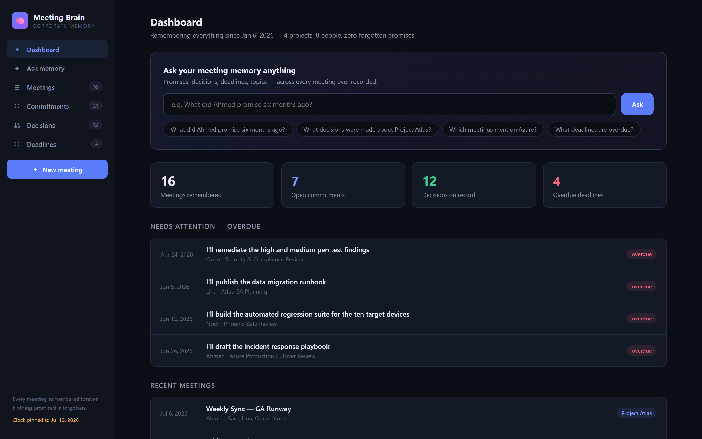
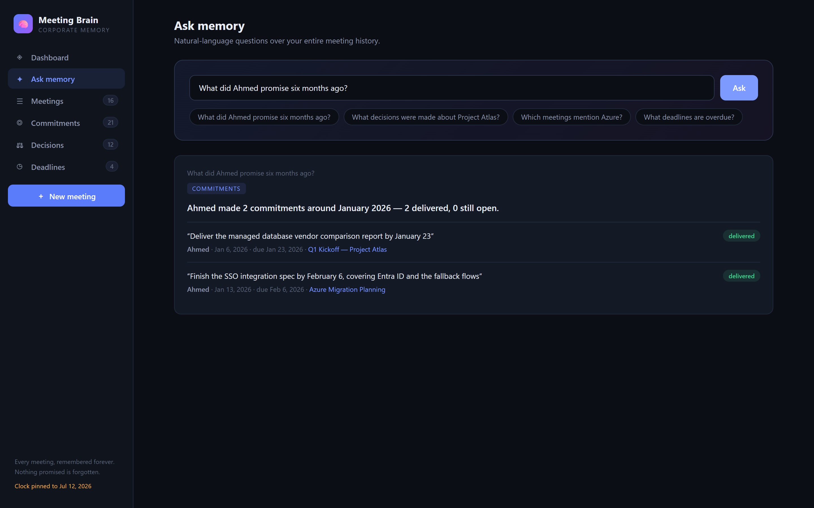
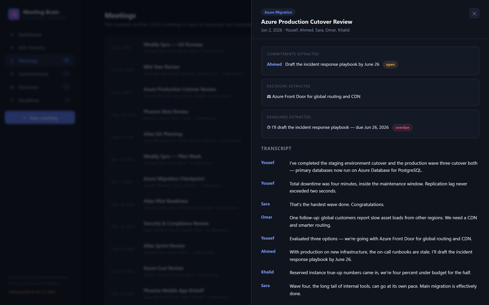

# 🧠 AI Meeting Brain

[](https://github.com/Only-A7med/ai-meeting-brain/actions/workflows/ci.yml)

**Corporate memory for every meeting, forever.**

Every meeting tool transcribes. None of them *remember*. Meeting Brain turns meeting
transcripts into permanent, structured, queryable organizational memory:

- **"What did Ahmed promise six months ago?"** → the commitment ledger answers, with quotes and dates
- **"What decisions were made about Project Atlas?"** → the decision log answers, with source meetings
- **"Which meetings mention Azure?"** → full-history topic search
- **"What deadlines are overdue?"** → the deadline radar checks every extracted date against today



## Quick start

```bash
pip install -r requirements.txt
python run.py
```

Open **http://127.0.0.1:8000** — the app boots with a seeded archive of 16 meetings
across 4 projects and 8 people (January–July 2026), so every feature is demonstrable
immediately.

## What it does

| Layer | Description |
|---|---|
| **Commitment Ledger** | Extracts "I'll…" statements per speaker, tracks open vs delivered, and auto-settles them when the same person later reports delivery |
| **Decision Log** | Captures "we decided / we're going with / let's go with…" with project, date, speaker, and source meeting |
| **Deadline Radar** | Parses dates ("by June 26") from conversation and flags anything overdue against today |
| **Ask Memory** | Natural-language queries with intent detection (commitments / decisions / deadlines / mentions), person resolution, and time-expression parsing ("six months ago", "last month", "in March") |
| **Full-text recall** | BM25 ranked search over every utterance ever recorded, as fallback for open-ended questions |

Asking the ledger a question, with citations back to the source meeting:



Every meeting keeps its full transcript alongside what was extracted from it:



More captures — commitments, decisions, deadlines, the archive — are in
[`docs/screenshots/`](docs/screenshots/).

## How it works

There is no machine-learning model here and nothing calls an external API. "AI" in the
name means classic NLP/information extraction, and the pieces are deliberately simple
and inspectable:

- **Extraction** is a set of regular expressions over sentence-split utterances
  (`app/extract.py`) — commitment, delivery, decision, and due-date patterns.
- **Ranking** is a hand-implemented BM25 inverted index over utterances (`app/search.py`),
  about 60 lines, no search engine dependency.
- **Query understanding** is keyword-set intent detection, name matching against known
  attendees, and rule-based parsing of time expressions (`app/engine.py`).
- **Answers** are composed from the matched records, not generated — every answer string
  is assembled from counts and the records themselves, and every claim carries a citation.

The upside is that it is fully offline, deterministic, and testable to exact strings. The
limits of a rule-based approach are real, and listed under
[Known limitations](#known-limitations).

## Architecture

```
run.py                    demo entrypoint (pins the demo clock, see below)
app/main.py               FastAPI routes
app/engine.py             MemoryEngine — ingestion, persistence, query parsing, answering
app/extract.py            transcript parsing + commitment / decision / deadline extraction
app/search.py             tokenizer + BM25 inverted index
app/models.py             dataclasses (Meeting, Commitment, Decision, Deadline)
app/seed_data.py          the seeded archive (16 meetings, Jan–Jul 2026)
static/index.html         single-page UI — vanilla JS, no build step
tests/                    pytest suite (59 tests)
docs/screenshots/         UI captures used above
.github/workflows/ci.yml  CI — ruff, then pytest
data/store.json           JSON store, created on first run (gitignored)
```

The extraction and ranking layers are cleanly separated behind `MemoryEngine`, so a real
pipeline (speech-to-text, generated answers, vector retrieval) can be plugged in without
touching the API or the UI.

## Configuration

Both variables are optional; the app runs with neither set.

| Variable | Default | Purpose |
|---|---|---|
| `MEETING_BRAIN_STORE` | `data/store.json` | Where the JSON store lives |
| `MEETING_BRAIN_TODAY` | unset (real date) | Pins the date that "overdue" and relative-time queries resolve against |

### The demo clock

The seeded archive is a fixed corpus whose narrative is tied to its calendar — "Q1
Kickoff" in January, "Mid-Year Review" in June. If it were read against the real date,
"six months ago" would drift away from those meetings and eventually match nothing.

So `run.py` pins the clock to `app/seed_data.REFERENCE_DATE` (2026-07-12), the date the
archive was written to be read on, and the UI says so in the sidebar. To follow the real
date instead:

```bash
MEETING_BRAIN_TODAY= python run.py              # bash
```

```powershell
$env:MEETING_BRAIN_TODAY = ""; python run.py    # PowerShell
```

Serving your own meetings rather than the demo? Leave `MEETING_BRAIN_TODAY` unset.

## API

| Endpoint | Purpose |
|---|---|
| `POST /api/ask` | `{"query": "..."}` → answer + items + citations |
| `GET /api/meetings` · `GET /api/meetings/{id}` | archive and full transcript with extracted memory |
| `POST /api/meetings` | ingest a new transcript (`Speaker: text` lines) |
| `GET /api/commitments?person=&status=` | commitment ledger |
| `GET /api/decisions?project=` | decision log |
| `GET /api/deadlines?overdue=true` | deadline radar |
| `GET /api/stats` | dashboard aggregates, plus the clock in effect |

## Adding meetings

Click **＋ New meeting** in the UI and paste a transcript, one utterance per line:

```
Ahmed: I'll deliver the report by July 20.
Sara: We decided to move the launch to September.
```

Timestamp prefixes from transcript exporters (`[00:12:30] Ahmed: …`) are stripped, and
lines that only look like `Speaker:` — a bare URL, for instance — are ignored.
Commitments, decisions, and deadlines are extracted on ingest and become part of
permanent memory instantly.

## Development

```bash
pip install -r requirements.txt -r requirements-dev.txt
ruff check .
pytest
```

59 tests cover the extractors, the transcript parser, the BM25 index, the query parser,
the configurable clock, and the API — including exact assertions on the four flagship
queries. The suite pins the clock to the seed reference date, so time-relative queries
stay deterministic. CI runs ruff and the suite on every push.

## Known limitations

This is a working demo, and it stops well short of production. Honestly:

- **Extraction is pattern-based.** It catches the phrasings in `app/extract.py` and
  misses paraphrases. There is no coreference resolution and no negation handling — "I
  won't be able to finish the report" is not read as a non-commitment.
- **Dates must be explicit.** A deadline needs "Month Day" in the same sentence. "Next
  Tuesday", "end of the quarter", and explicit years are not parsed, and there are no
  time zones.
- **Settlement is a heuristic.** A delivery closes an open item when they share two
  content words, so one delivery can close several similar commitments, and two unrelated
  items sharing two words can be matched wrongly.
- **Storage is a single JSON file**, rewritten in full on every ingest, held entirely in
  memory. There is no concurrency control, so parallel writes will lose data, and the
  BM25 index is rebuilt on load — fine for thousands of utterances, not millions.
- **No authentication, no multi-tenancy.** Anyone who can reach the port can read and
  write all memory. Production would need auth, per-tenant isolation, and an audit trail.
- **No transcription.** Transcripts are pasted or POSTed; capturing audio is not part of
  this.
- **The UI is untested.** `static/index.html` has no build step and no test coverage; the
  suite exercises the API beneath it.

## Roadmap

Live audio via speech-to-text, generated abstractive answers over the retrieved records,
hybrid vector + BM25 retrieval, calendar and Slack integrations, multi-tenant access
control.

## Author

Ahmad Mustafa — [@Only-A7med](https://github.com/Only-A7med)

Licensed under the [MIT License](LICENSE).
